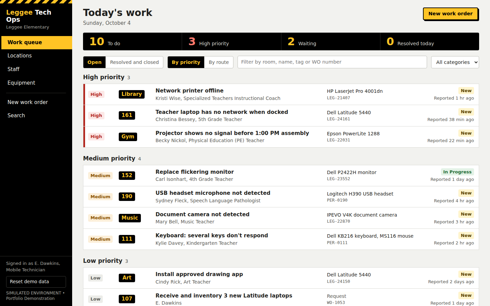
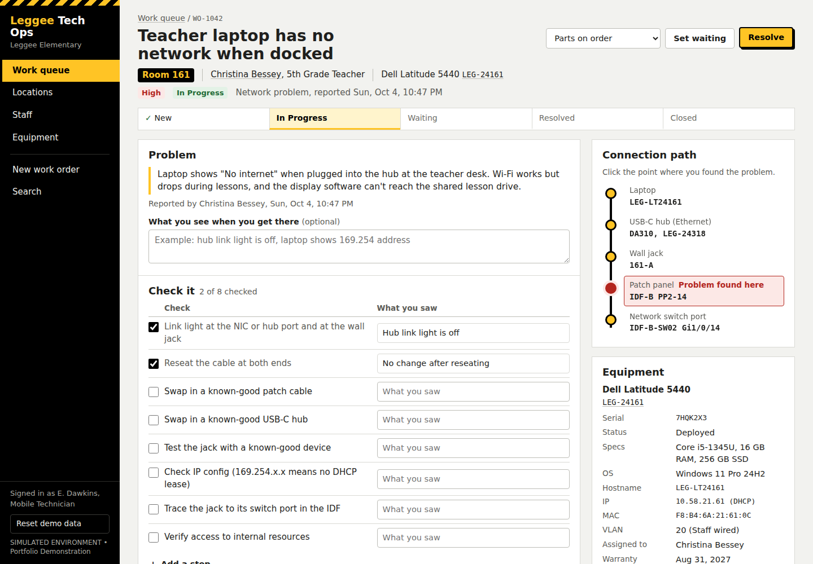
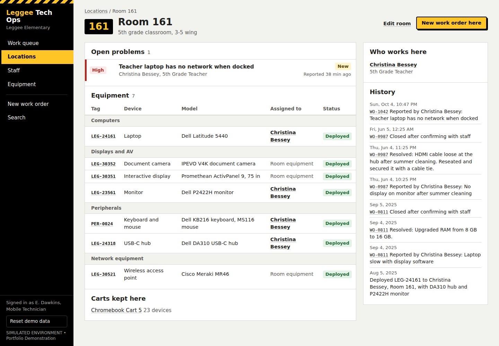
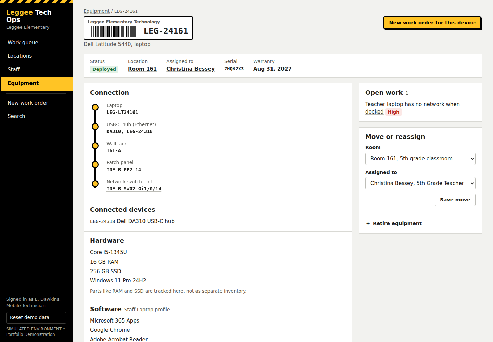
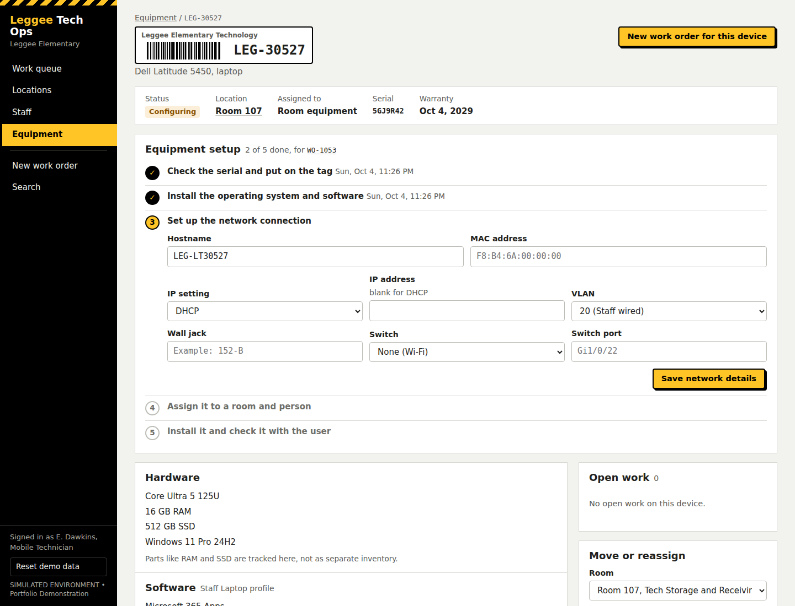
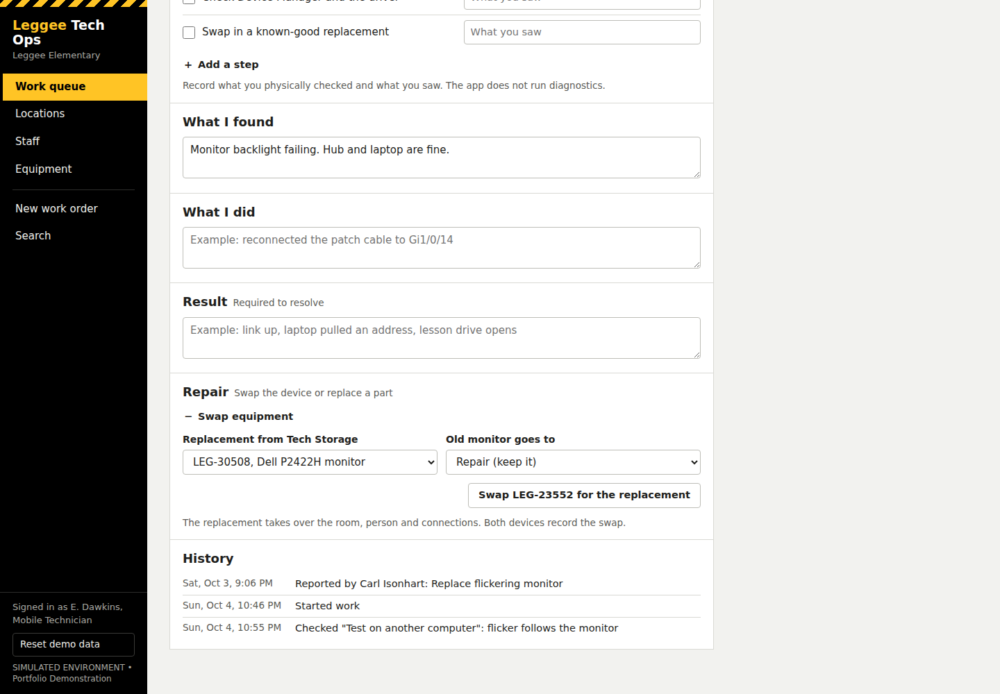

# Leggee Tech Ops

**SIMULATED ENVIRONMENT • Portfolio Demonstration.** Leggee Tech Ops is a small, self-contained web app that simulates a school technician's day at an elementary school: the work queue, the rooms, the staff, the equipment inventory, troubleshooting, repairs and new-equipment setup. Every room, device, serial number, IP address and work order in it is fictional. It is not connected to, and does not represent, any school district's real systems.

## Why I built it

I applied for the Mobile Technician position at Huntley Community School District 158. The posting describes two jobs in one: putting hardware and software into service, and keeping an accurate inventory while troubleshooting problems. I built this to think through that work in a concrete way, not just to list it on a resume. I used simulated rooms and equipment because I don't have access to a district's internal room or inventory data.

## What it models

| From the job posting | Where it shows up in the app |
|---|---|
| Install hardware: power supplies, motherboards, cards, processors, fans, memory, NICs | **Replace a part** inside a work order. Records the old and new part, updates the device's specs for RAM, SSD and processor, and writes it to history |
| Install and connect peripherals: monitors, keyboards, printers, disc drives | **Swap equipment** and the Equipment pages. A replacement monitor takes over the room, person and hub connection; the failed one goes back to Tech Storage as In Repair |
| Connect hardware to the network | **Connection path** (laptop, USB-C hub, wall jack, patch panel, switch port) and the network step of equipment setup |
| Load software and local applications | Equipment setup applies a standard software profile; each device lists what is installed |
| Maintain an accurate hardware and software inventory | **Equipment** list and records: tag, serial, model, room, person, status, specs, software, network details and history. Receiving checks the serial against the label and blocks duplicates |
| Assist with troubleshooting | **Work orders** with a "Check it" list, findings, actions and a result |
| Communicate with all levels of staff | Every work order is tied to the person who reported it, and cannot be closed until the fix is confirmed with them |

## Major workflows

**Support: something is wrong.** Open a work order from the queue, see the room, the person and the device, work through the checks, mark where along the connection path the problem was found, record what you found and did, resolve it, confirm with the staff member, close it.

**Context: the room and the equipment.** Each room lists who works there, what is installed, what is broken and what happened recently. Each device has a tag label, status, location, assigned person, connection, hardware, software, network details and history.

**Equipment: new equipment arrives.** Receive it, tag it, check the serial, install the software profile, set up the network connection, assign it to a room and person, and check it with the user before marking it deployed. Each step is logged.

**Repair: swap a device or replace a part.**

## What is simulated and what is real

| Simulated | Real |
|---|---|
| All rooms and room numbers | Staff names and job titles, taken from the public Leggee staff directory (placements are fictional) |
| All devices, serial numbers, IP and MAC addresses, VLANs, wall jacks and switch ports | Product names such as Dell Latitude 5440, Dell DA310 and Cisco Catalyst, used for realism |
| All work orders and service history | The work a Mobile Technician does, as described in a public job posting |
| The technician user ("E. Dawkins") | The code and the way the workflows behave |

No email addresses, student information or other personal data are included. The app does not diagnose anything: the troubleshooting list records what the technician physically checked and what they saw. This project is not affiliated with or endorsed by Huntley Community School District 158.

## How to run it

1. Download `index.html`.
2. Open it in a web browser (tested in Chrome). There is nothing to install and no server to run.
3. On first use, click **Reset demo data** at the bottom of the left sidebar (click twice to confirm).

Your changes are saved in your browser's local storage. Each browser keeps its own copy, so use **Reset demo data** if the data looks stale.

## How it works

**Architecture.** One HTML file with vanilla HTML, CSS and JavaScript. There are no libraries, CDNs, web fonts, backend, database or build step. The script is organized into labeled sections: config, seed data, store, helpers, one section per screen, router and actions.

**Data model.** Five stored objects: locations, staff, assets (equipment), work orders and events. Locations, staff and assets are keyed by stable IDs, so renaming or renumbering a room never breaks a link. Work orders reference a location, the reporting staff member and optionally a device. Everything a technician does writes an **event** that links to the relevant work order, device, room and person.

**State management.** A single state object is saved to `localStorage` after every change (key `leggee-techops:v1`). Screens only read state. Changes go through two functions that update state, write a history event, save, and re-render. The starting data is generated deterministically from a fixed seed, so tags and serial numbers are identical after every reset. Only the timestamps are relative to "now", so the queue always looks current. Navigation uses URL hash routes (for example `#/wo/WO-1042`), so the browser's Back button works.

**Design decisions.**
- *One shared history log.* Each page's history is the log filtered by an ID, so a single repair appears on the device, the room and the person without duplicated data.
- *Parts are specs, not inventory.* RAM and SSD are fields on a device. A part replacement updates the field and logs the event, which avoids tracking every stick of memory as its own asset.
- *Chromebooks belong to carts, never to students.*
- *Software comes from standard profiles*, as imaging would work in practice, with no license tracking.
- *Simulation is stated, not hidden.* Every screen carries the simulated-environment label.
- *Scope was kept small on purpose.* No authentication, charts, analytics, AI features or integrations.

## Testing

I ran an 11-test manual pass in Chrome on the screens and workflows a technician would use. Nine passed and two found real problems, which are documented rather than fixed. The application also had 78 automated browser checks run by the AI assistant that generated the code. Full details, including what was and was not tested, are in [TESTING.md](TESTING.md).

## Known limitations

- Device History shows only the latest 25 events (Room and Staff pages show 12) without saying older ones are hidden. Records are stored; only the display is cut off. *(ISSUE-1)*
- After a swap, the Swap box stays on the page, and swapping a second time corrupts that spare device's record. Swap once only. *(ISSUE-2)*
- The barcode on the equipment tag label is decorative and does not scan.
- Desktop browsers only; there is no phone layout.
- The Equipment list shows up to 300 rows.
- No real integrations, device management, authentication, multiple users, charts, notifications, printing or export.

## How it was built

I built this with Claude, an AI assistant from Anthropic. I defined the scope, the workflows, the simulated-data and privacy rules, and the honesty constraints; directed each round of changes; and ran the manual test pass. Claude generated the code and ran the automated checks. I'm saying this plainly because the point of the project is the workflow thinking and the verification, not hand-written JavaScript.

## What I learned

- Turning a job posting into a model of the actual work (rooms, people, equipment, problems, history) was harder and more useful than writing the screens.
- Passing automated checks did not mean the app was correct. A manual pass found two problems the automated checks had missed, including one that could quietly make an inventory record wrong.
- Accurate inventory depends on small rules: unique serials, checking a serial against the label, recording where a device is and who has it, and keeping history.
- Honest documentation matters. Separating what I tested myself from what was reported by an automated script made the project easier to trust.
